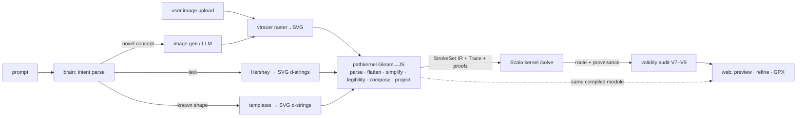

# Specification: PathKernel — Universal Image Input, Provably Valid Paths

**Date:** 2026-06-12 · **Status:** Draft for review · **Refines** `strava-art-mvp` §6 (compiler model)
**Supersedes:** the per-runtime geometry implementations (Python `projector/normalizer/composer` math and TS `geo/project.ts` must converge into ONE kernel); strava-art-mvp's "image-trace is P4" deferral (any-image input becomes core).

## 1. Why (observed failures this spec exists to fix)

Live verification of the strava-art-mvp build (2026-06-12, golden Valentine's scenario, fidelity 86) exposed the real product law: **a route that isn't a valid, legible path is not a product — it's a scribble with a good score.**

Observed defects, each traceable to geometry living in the wrong place or having no contract:

| # | Defect | Root cause |
|---|--------|-----------|
| D1 | "ANNA + TOM" solved into illegible scribble (each glyph ~120 m ≈ one block) while fidelity read 86 and **diagnostics were empty** | legibility law (min feature ≥ 2–3 blocks) is prose in the spec, not an enforced theorem in code |
| D2 | Solved route contained **19 zero-length duplicate points** | kernel output has no validity post-conditions |
| D3 | **2 inter-point gaps > 100 m** that nothing can classify as "long straight street edge" (fine) vs "matching discontinuity" (invalid) | no per-edge provenance; validity is unprovable from the output alone |
| D4 | Web `project()` re-implements Python `projector.py` — they must "happen to agree" | duplicated math = eventual drift; determinism across surfaces is hope, not property |
| D5 | Start/end gap 74.7 m on a `close_loop` solve, silently | loop closure has no post-condition either |

## 2. Decision

1. **Any image becomes a first-class frontend, now.** The user may upload an image, or the brain generates one from the prompt; `vtracer` (already installed) contours it to SVG. Text and template shapes are *also* emitted as SVG paths (Hershey data → `d` strings). **SVG path data is the single source format for all art.**
2. **All pure path math moves into one deterministic kernel — `pathkernel/` — written in Gleam, compiled to JavaScript.** One artifact consumed by both the web app (Vite import, drives preview + gizmo projection) and the gateway (Bun import, authoritative compile before solve). Python keeps only orchestration (intent, image generation, vtracer invocation); the Scala kernel keeps only street matching.
   - *Why Gleam→JS, not Scala:* the Scala kernel cannot run in the browser, and Scala.js would fork the kernel build in two; Gleam is pure, typed, no-runtime-dependency, and its JS output runs byte-identically in browser and Bun. (IEEE-754 doubles are identical across both.) Scala remains the right home for the graph/HMM work it already owns.
3. **Validity is a contract, not an aspiration.** Every kernel stage declares post-conditions (§5); property-based tests + shared golden vectors enforce them in CI; the solver's output is audited against V7–V9 on every solve and the audit ships in the API response.

## 3. Pipeline



## 4. The kernel's stages (all in `pathkernel/`, all total functions)

```
parse      : SvgPathData -> Result(List(SubPath), ParseError)   // M/L/H/V/C/S/Q/T/A/Z, abs+rel, total
flatten    : SubPath -> Polyline                                 // Bézier/arc → chords, max sagitta ε_flat
simplify   : Polyline -> Polyline                                // Douglas–Peucker, max deviation ε_simp
legibility : StrokeSet × ScaleMeters -> (StrokeSet, List(Diagnostic))  // enforce law 3; D1 becomes impossible silently
compose    : StrokeSet -> ArtPlan                                // ordering + connectors → ONE line (port from Python)
project    : ArtPlan × Placement -> Trace                        // unit → WGS84, rotation about bbox center, densify
```

ε_flat and ε_simp are **derived from physical scale** (placement width in meters vs ~20 m GPS jitter), passed explicitly — never global state.

## 5. Validity invariants (the math; each is a property test)

- **V1 Totality** — `parse` never throws and never silently drops a command; unsupported input → typed `ParseError` with byte offset.
- **V2 Finiteness** — every emitted coordinate is finite; unit-space points lie in [0,1]²; WGS84 points lie in the placement bbox ⊕ rotation envelope.
- **V3 Flattening bound** — max distance from any chord to its source curve ≤ ε_flat (sagitta-bounded recursive subdivision, deterministic depth).
- **V4 Simplification bound** — Hausdorff(simplified, original) ≤ ε_simp; endpoints preserved exactly.
- **V5 No degenerate geometry** — no zero-length segments (min vertex spacing δ > 0); every stroke ≥ 2 points; closed subpaths (`Z`) stay exactly closed.
- **V6 Continuity** — `compose` output is one polyline; consecutive segment index ranges tile exactly (seg[i].end == seg[i+1].start); shared endpoints are bit-equal, not ε-equal.
- **V7 Route integrity (solver post-condition)** — solved coordinates: finite, deduped (fixes D2), Σ inter-point distances == reported distance_km within 1 m.
- **V8 Edge provenance (fixes D3)** — Scala `/solve` emits, per consecutive coordinate pair, whether it lies on a matched OSM edge; any gap > 100 m not on a single edge fails the audit with an actionable diagnostic.
- **V9 Loop post-condition (fixes D5)** — `closeLoop: true` ⇒ start/end gap ≤ 30 m in the response, or an explicit `loop_gap_m` diagnostic; never silent.
- **V10 Determinism** — same input bytes + params ⇒ byte-identical output across web (browser) and gateway (Bun); enforced by running the same golden vectors in both runtimes in CI. No randomness, no time, no map-iteration-order dependence (Gleam gives this for free).

Diagnostics remain adaptive, never rejecting (strava-art-mvp §6.2 stands): each failed soft law maps to a knob — *scale up · reduce detail · move area · split runs · accept distance*.

## 6. Repo changes

- **NEW `pathkernel/`** — Gleam project (`gleam build --target javascript`); published into `web/` and `server/` as a workspace artifact (no npm publish needed; build step writes `pathkernel/dist/`). Tests: `gleam test` (property-based via qcheck-style generators) + `golden/` vectors (SVG in, IR out, JSON) consumed by web Vitest and gateway bun:test.
- **`backend/`** — keeps: intent parse, image generation (LLM/diffusion later; LLM-path SVG now), vtracer raster→SVG, neighborhood data, fidelity scoring, solve orchestration. Deletes (after parity): `projector.py`, `normalizer.py` geometry, `composer.py` (logic ports to Gleam; Python calls the gateway's compiled kernel via one internal endpoint `POST /api/kernel/compile` OR shells `bun run pathkernel/cli.ts` — decide in P0 by measuring; no duplicated math either way).
- **`matcher/`** — `/solve` adds per-pair edge provenance (V8) + endpoint dedup (V7) + `loop_gap_m` (V9). Still deterministic, still soft-failure.
- **`web/`** — replaces `src/geo/project.ts` with the kernel import; preview renders kernel output directly (also fixes the preview-card overflow defect seen in review).
- **`server/`** — `POST /api/art/compose` accepts `{prompt}` *or* `{svg}` *or* `{image: dataURL}` (image forwarded to brain for vtracer); response carries the kernel's validity report verbatim.

## 7. Scope

### In
- `pathkernel/` Gleam→JS with stages §4, invariants §5, property tests, golden vectors, dual-runtime CI check.
- Any-image input end-to-end: upload → vtracer → SVG → kernel → solve (Prague).
- Unify text/templates onto SVG d-strings.
- Solver validity audit (V7–V9) surfaced in API + Refine UI ("path proof" panel: per-law pass/diagnostic).
- Legibility enforcement with physical units (D1 regression test: golden Valentine's prompt at 8 km MUST emit a legibility diagnostic for 10-glyph text, suggesting `scale_up` or `split_runs`).

### Out
- Image *generation* models (diffusion) — the upload + LLM-SVG paths cover MVP; gen is a follow-up frontend.
- Multi-city, accounts, animation export (unchanged from strava-art-mvp).
- Rewriting the Scala matcher in Gleam — street matching stays on GraphHopper/JVM.

## 8. Acceptance criteria

- [ ] `gleam test` green; golden vectors byte-identical when run in browser (Vitest/jsdom) and Bun.
- [ ] Property tests for V1–V6 (≥ 200 cases each) green in CI.
- [ ] Upload of a raster image (PNG heart photo, line drawing) produces a solved Prague route with validity report all-green.
- [ ] Golden Valentine's scenario: solved route passes V7–V9 (no dupes, every >100 m gap edge-attested, loop gap ≤ 30 m or surfaced).
- [ ] D1 regression: sub-resolution text emits a legibility diagnostic — empty diagnostics on that input is a test failure.
- [ ] `web/src/geo/project.ts` and `backend/services/projector.py` deleted; exactly one projection implementation remains.
- [ ] Same SVG compiled twice on both surfaces ⇒ byte-identical IR (V10 CI job).

## 9. Phasing

1. **K0 Kernel core** — Gleam scaffold, `parse`+`flatten`+`simplify`, V1–V5 property tests, golden vectors, dual-runtime CI. *Gate: same vectors byte-identical in Bun + browser.*
2. **K1 Compose & project port** — port Python composer/projector into kernel; web + gateway consume it; delete TS/Python twins. *Gate: golden Valentine's plan identical pre/post port; D4 closed.*
3. **K2 Solver proofs** — Scala provenance/dedup/loop-gap (V7–V9); audit in API + Refine "path proof" panel. *Gate: D2/D3/D5 regression tests green.*
4. **K3 Any image** — upload UI + vtracer path through `/api/art/compose {image}`; legibility law live (D1). *Gate: photo → valid solved route, sub-resolution warnings firing.*

## 10. Risks

- **Gleam ecosystem is thin** (no turnkey property-test lib with shrinking): mitigated — generators are ~200 lines we own; worst case golden-vector density compensates.
- **Python↔kernel hop adds latency** to compose: bounded — one local HTTP/CLI call, ms-scale vs the 90 s solve budget; measured at K1 gate.
- **vtracer output complexity** (thousands of nodes on photos): kernel's simplify is the defense; stroke budget law caps the rest.
- **Two-language pure core** (Gleam) raises contributor bar: accepted consciously — the alternative (drifting twin implementations) already produced D4.
