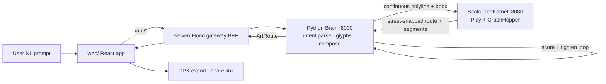

# Specification: Ghost Tracks MVP — Describe → GPS Art Route

**Date:** 2026-06-10 · **Status:** Draft for review · **Supersedes UI direction of** `architecture-refactor`

## 1. Vision

The "ChatGPT for runners": a user *describes* an occasion in natural language —

> "For Valentine's Day I'd like to surprise my boyfriend — write our names and create a heart shape."

— and Ghost Tracks computes a **runnable, single-track route through real city streets** that draws it, polished enough to gift. Route quality and viability **are** the product.

## 2. Research grounding (verified 2026-06-10)

- **Demand is proven and seasonal.** Hearts/proposals are the #1 documented GPS-art genre (strav.art hosts 130+ heart works; proposal routes recur in press). Strava itself promotes the practice; famous artists (Lenny Maughan) plan routes *by hand* — the planning bottleneck is our wedge.
- **Market gap is exactly our feature.** Existing tools (Draw My Loop, GPSArtify, cityheart.run, WillCycle) all require the user to draw/upload the artwork or accept one canned shape. **None accept natural language and compose multi-stroke art.** Composition is the unsolved step.
- **Craft rules we must encode** (from practitioner guides):
  - One continuous line; multi-stroke art is connected via **baseline connectors** or **exact retracing** (retraced segments visually disappear). The GPS-pause "pen lift" trick is unavailable to a *route*, so the solver must do connectors/retrace.
  - **Letters are single-stroke skeletons** ("computer font, not handwriting"): grid proportions ≈ 1×2 blocks per letter, 1 block between letters, 2 between words; disambiguate r/s/a forms; fake curves with 45° tangents.
  - Grid-with-diagonals street topology is the best canvas; closed shapes (hearts) read best and loop naturally; strokes must exceed GPS jitter (~5–15 m urban multipath) — tiny detail gets eaten.
  - Failure modes to detect: blocked land (campuses, water, highways), blocky/ambiguous letterforms, wrong proportions vs. street geometry, elevation surprises.
- **Strava API cannot create routes** (Routes endpoints are read-only; no `POST /routes`). The standard flow is **GPX export → manual import** (route import needs a Strava subscription, web-only) — or import to Garmin/Komoot and *record* with Strava; the recorded activity is the shareable artifact. **Core loop must not depend on Strava's API.**
- **Single-stroke Hershey fonts** are the confirmed primitive for street-writable text (pen-plotter lineage). Glyph skeletons must be simplified/straightened to street-grid resolution.

## 3. Canonical user story (MVP acceptance scenario)

1. Anna opens Ghost Tracks, types: *"for valentine's day — write 'ANNA + TOM' and a heart, near Vinohrady, about 8 km, end where we start."*
2. The app shows a **composed artwork preview** (names in single-stroke letters + heart, one continuous line with visible connector strategy) placed on the map over Vinohrady.
3. Anna drags/scales/rotates the placement; nudges a control point; toggles "close loop". The route re-solves live with a **fidelity score** and distance.
4. She exports **GPX** (one tap) with import instructions for Strava/Garmin/Komoot, and gets a **shareable link** rendering the route preview.
5. The run, when recorded, draws the art. End-to-end time-to-route: **under 2 minutes**.

## 4. Scope

### In (MVP)
- NL describe → intent parse (text-to-write, shapes, occasion, area, distance, loop preference).
- **Open-ended design via the compiler model (§6): any input compiles to one StrokeSet IR.** MVP ships three frontends — glyphs (text), templates (known shapes), LLM-path (novel concepts) — plus the **Normalizer** that adapts any IR to the medium laws (§6.2). The image-trace frontend (universal fallback) is P4 but plugs into the same IR with zero pipeline rework (vtracer + OpenCV already installed in `backend/`).
- **Composer**: lays out strokes in unit canvas; orders strokes (min-connector-cost graph problem); inserts baseline/retrace connectors → ONE continuous polyline.
- **Placement**: bbox + rotation + scale onto chosen neighborhood (drag/scale/rotate on map).
- **Solve**: continuous polyline → street-snapped route (Scala kernel via GraphHopper; Mapbox fallback), optional loop closure, fidelity scoring, iterative tightening (existing Python validator).
- **Refine UI**: draggable control points, live re-solve, undo/redo, score meter.
- **Export/share**: GPX download + import instructions; shareable read-only route link.
- Full navigation flows, polished (motion, cursor, easings) per §8.

### Out (subsequent specs)
- Pre-solved area galleries / runner-habit heatmaps ("devise the area" v2 — MVP ships presets: distance, loop, start-near-me).
- .gif/reel animation export.
- Accounts, saved-route library, Strava OAuth anything.
- Cities beyond Prague (architecture must be city-parametric; only Prague data ships).

## 5. Architecture



**Three runtimes, fixed roles (no additions):**
- **`web/` — React frontend (NEW).** React 19 + TypeScript + Vite. The product surface.
- **`backend/` — Python Brain (extend).** FastAPI. NL intent → ArtPlan: Hershey glyph layout, shape generation (existing `shape_generator`/templates/LLM), stroke ordering + connector insertion, validation/tightening loop (existing `shape_validator`, `street_mapper` densify).
- **`matcher/` → **`kernel/` — Scala GeoKernel (extend, rename).** Play + GraphHopper 8.0 pinned, Prague OSM snapshot. Pure, deterministic `solve`: polyline trace → street-matched route; loop closure (first≈last naturally cycles in map-matching); per-segment provenance (stroke vs connector). Long-term home for graph rigor (ordering optimization, drawability scoring).
- **`server/` — Hono gateway (keep).** BFF: routing, timeouts, zod validation, single origin for the React app.
- **Legacy `src/` SvelteKit app: frozen as reference; retired at MVP parity.** Its API endpoints' contracts are ported to the gateway.

## 6. The functional kernel — core abstraction

### 6.1 The compiler model — how "any design" works

We do not constrain the design's *subject*; we constrain the *medium*, and we structure generation as a compiler: **many frontends → one closed IR → one backend.**

```
Frontends (anything → StrokeSet IR)            determinism
  text          → Hershey single-stroke glyphs  exact
  known shape   → parametric template            exact
  novel concept → LLM-generated path             variable
  any image     → vtracer contour trace          universal (P4; deps installed)

IR         StrokeSet: Stroke[] in unit space — the ONLY format downstream sees
Normalizer IR → drawable IR: simplify to street resolution (Douglas-Peucker),
           prune sub-jitter detail, merge/prune strokes, scale to distance budget
Composer   order strokes + insert connectors/retraces → ONE continuous line
Backend    place → project → solve → score → tighten (unchanged for all frontends)
```

A new kind of input is a new frontend emitting IR — never a pipeline change. "Anything" is covered today by the LLM-path frontend (variable quality) and upgraded later by image-trace (anything an image model can render, vtracer can stroke).

### 6.2 Medium laws — the real constraints

The constraints are physics of streets + GPS + human legs, not product choices. The **Normalizer enforces them by adaptation** (lossy compilation — like printing any image on a dot-matrix printer); the **validator forecasts and explains** what survives:

| # | Law | Consequence |
|---|-----|-------------|
| 1 | Continuity — a run is one track | every extra stroke costs connector ink; stroke ordering is a min-connector-cost graph problem |
| 2 | Line-art only — no fill/shading | regions read by outline only |
| 3 | Resolution limit — streets sample the plane at block frequency | min feature ≈ 2–3 blocks; sub-GPS-jitter (~20 m) detail vanishes (a Nyquist limit) |
| 4 | Piecewise-linearity — streets are straight segments | curves become polygons; design must survive simplification |
| 5 | Graph connectivity | water/highways/campuses are forbidden zones; solver failures map to "move/rotate/rescale" advice |
| 6 | Length budget — 5–25 km human range | caps total ink + connectors; detail trades against distance |
| 7 | Stroke budget | many disconnected components degrade into connector noise |

Every diagnostic is actionable and tied to a design knob: *scale up · reduce detail · move area · split into multiple runs · accept N km*. No design is rejected outright — it is adapted, scored, and explained.

### 6.3 Types

State is a pure function of (Plan, Placement, SolveResult); every stage is a total function with explicit types. TS (zod), Python (pydantic), Scala (case classes) mirror these:

```
Intent      = { texts: string[], shapes: ShapeRef[], occasion?, area?, distance_km?, loop: bool }
Stroke      = { points: UnitPoint[], kind: 'glyph'|'shape'|'connector', retrace: bool }
ArtPlan     = { strokes: Stroke[], order: int[], continuous: UnitPoint[] }   // composed, ONE line
Placement   = { bbox: BBox, rotation_deg: float, anchor: LngLat }
Trace       = LngLat[]                                                        // plan ∘ placement, densified ~80 m
SolveResult = { coordinates: LngLat[], segments: SegmentMeta[], distance_km, duration_min,
                fidelity: 0..100, success, error? }
ArtRoute    = { intent, plan, placement, solve: SolveResult, gpx_url, share_id }
```

Pipeline: `parse(text) → Intent`, `compose(Intent) → ArtPlan`, `place(ArtPlan, area) → Placement`, `project(plan, placement) → Trace`, `solve(Trace, opts) → SolveResult`, `score/tighten` loop until fidelity ≥ threshold or max retries. Edits re-enter at `place` or `compose` — never mutate downstream state.

## 7. Service contracts

- **Python** `POST /art/compose` `{prompt, area?, distance_km?}` → `{intent, plan, placement, preview_svg}`; `POST /art/solve` `{plan, placement, opts}` → `ArtRoute` (drives kernel + scoring + tighten loop). Existing `/describe`, `/generate` remain until parity.
- **Scala** `POST /solve` `{trace: [[lng,lat]], profile, closeLoop, segments}` → `SolveResult` (extends existing `/match`; keeps `/match`, `/health`).
- **Gateway** mirrors Python endpoints at `/api/art/*` with zod validation + 90 s timeout; serves `GET /api/route/:share_id` for share links (MVP persistence: SQLite via Bun).

## 8. Frontend — flows, stack, polish

**Stack:** React 19, Vite, TypeScript · **Radix UI primitives** (dialogs, popovers, sliders, toasts) · **styled-components v6** for component styling · **UnoCSS** with a **Tachyons-style shortcut/utility layer** for atomic layout · **XState v5 + @xstate/react** (state machines = "function of state"; generation machine ported from Svelte) · **react-map-gl + mapbox-gl** · **@turf/turf** (geo math), **d3-geo** (projection), single-stroke glyph data (Hershey Simplex, EMS) · **motion** (Framer) for easings · existing **gpx-builder** for export.

**Navigation flows (full MVP set):**
1. `/` **Landing/Compose** — hero prompt input (the ChatGPT moment), occasion chips (Valentine's, proposal, birthday), example gallery, recent local creations.
2. `/studio` **Studio** — the core; three-stage progressive flow in one screen: **Compose** (prompt → artwork preview card with stroke/connector legend) → **Place** (map; drag/scale/rotate placement gizmo; area + distance + loop presets) → **Refine** (control-point drag, live re-solve ≤ 2 s, fidelity meter, undo/redo ≥ 20 steps).
3. `/r/:share_id` **Share** — read-only route render, distance/score, GPX download, per-platform import instructions.
4. Error/empty/loading states designed for every flow (skeletons, optimistic placement, solver-busy shimmer).

**Polish bar (explicit, testable):** all transitions use intentional easing curves (`motion` springs/custom cubic-bezier — no defaults); cursor states for every interactive surface (grab/grabbing on map gizmo, crosshair on control points); Radix-powered accessible keyboard paths; 60 fps map interactions; zero layout shift on solve updates.

## 9. Quality & viability scoring

- **Fidelity score** (existing Python blended Hausdorff + resampled distance + raster IoU) surfaced as the product's hero metric.
- **Legibility guards** from research: minimum stroke length vs. block size, letterform disambiguation set (r, s, a), warn when placement bbox implies sub-jitter detail (< ~20 m features).
- **Viability checks:** route success from kernel, blocked-area detection deferred to kernel's matching failures (surfaced as actionable "shape crosses unroutable area — try moving/rotating").

## 10. Testing

- **Python:** unit tests for glyph layout, connector insertion, intent parsing (golden prompts incl. the Valentine's scenario); existing validator tests extended.
- **Scala:** munit tests for `/solve` determinism (same trace ⇒ byte-identical), loop closure, segment provenance.
- **Web:** Vitest component tests; **Playwright e2e**: Valentine's scenario end-to-end against live local stack (compose → place → refine → GPX downloads, share link renders).
- **Visual verification** in Chrome DevTools at every milestone (per project workflow).

## 11. Phasing

1. **P0 Foundation:** scaffold `web/` (Vite+React+UnoCSS+styled-components+Radix+XState), port map view + `/api/route` parity through gateway. *Gate: map renders, old describe flow callable from React.*
2. **P1 Compose:** Python intent parse + the three MVP frontends (glyphs, templates, LLM-path) emitting StrokeSet IR + Normalizer (medium laws) + composer (strokes→continuous line) + preview SVG. *Gate: "ANNA + TOM + heart" composes correctly as one line, unit-tested; an arbitrary LLM-path concept ("a fox") normalizes without pipeline changes.*
3. **P2 Place & Solve:** Scala `/solve` + placement gizmo + live re-solve + fidelity meter. *Gate: composed art lands on Prague streets ≥ target fidelity.*
4. **P3 Refine & Ship:** control-point editing, undo/redo, GPX + share links, polish pass, e2e green. *Gate: §3 scenario under 2 minutes; Playwright passing.*
5. **P4 (post-MVP spec):** pre-solved areas/runner habits, gif export, accounts.

## 12. Risks

- **Rewrite tax (accepted by decision):** map + flows re-ported to React before new value ships — mitigated by P0 gate and frozen Svelte reference.
- **styled-components is in maintenance mode** (2025 announcement): accepted consciously; isolate via design-tokens so a future swap is mechanical.
- **Composition hard cases** (cursive intent, dense text in organic streets): the Normalizer adapts rather than rejects — MVP letterforms are uppercase single-stroke; harder inputs degrade gracefully to LLM-path with explicit fidelity forecast + diagnostics, never a hard "no".
- **Kernel hosting:** GraphHopper graph is stateful/in-memory → needs an always-on host at release (Fly/Railway); Python can be serverless; web on Vercel.
- **LLM dependence:** glyphs + templates are deterministic; LLM is only required for novel shapes and intent parsing — degrade gracefully to template picker.

## 13. Acceptance criteria (MVP done =)

- [ ] §3 Valentine's scenario passes end-to-end on local stack, under 2 minutes, via Playwright.
- [ ] Composed output is ONE continuous line with explicit connector/retrace segments.
- [ ] Same input ⇒ identical route (kernel determinism test green).
- [ ] Fidelity score ≥ 70 on the golden scenario; score visible in UI.
- [ ] GPX imports cleanly into Strava (manual check) and Garmin/Komoot.
- [ ] Share link renders without auth.
- [ ] Polish bar of §8 verified visually in Chrome DevTools.
- [ ] Legacy Svelte app retired; README/ports updated (web :5180, gateway :3000 reclaimed, brain :8000, kernel :8080).
