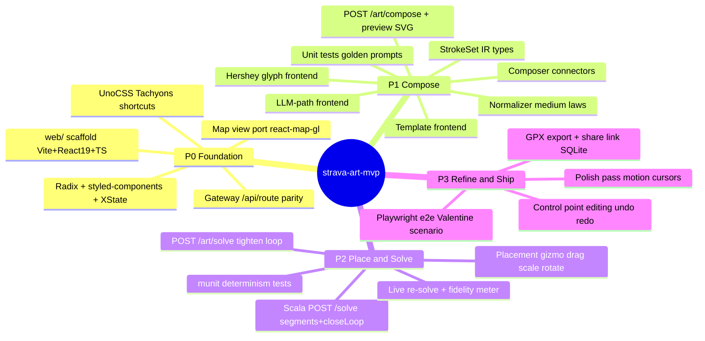

# Execute: strava-art-mvp spec (openspec/changes/strava-art-mvp/SPEC.md)

## Context

User said "execute the openspec". Active change: `strava-art-mvp` (supersedes `architecture-refactor` UI direction).
Repo state: `backend/` FastAPI brain, `matcher/` Scala Play+GraphHopper (untracked, working `/match`),
`server/` Hono gateway (minimal `/api/generate` proxy), `src/` legacy SvelteKit (frozen reference).
Branch: `feat/strava-art-mvp` off `main` (uncommitted WIP carried over — it is part of this change).

## Plan (checkable)

### P0 — Foundation
- [x] Create branch `feat/strava-art-mvp`
- [ ] Scaffold `web/` (Vite + React 19 + TS, port 5180 strictPort, UnoCSS w/ Tachyons-style shortcuts, styled-components, Radix, XState v5, react-map-gl, motion)
- [ ] Gateway: rewrite `server/index.ts` — zod-validated proxies: `/api/route` (→ kernel `/match` | Mapbox fallback), `/api/describe`, `/api/generate` (→ brain), 90s timeouts
- [ ] Map view in React renders Prague; old describe flow callable through gateway

### P1 — Compose (Python brain)
- [ ] `models/ir.py`: Stroke / StrokeSet / ArtPlan / Intent / Placement (pydantic, mirrors §6.3)
- [ ] Frontends: `frontends/glyphs.py` (Hershey Simplex single-stroke), `frontends/templates.py` (wrap existing shape_templates → IR), `frontends/llm_path.py` (DSPy → IR)
- [ ] `services/normalizer.py`: Douglas-Peucker to street resolution, sub-jitter pruning, stroke budget, distance scaling (laws 1–7)
- [ ] `services/composer.py`: stroke ordering (min-connector-cost), baseline/retrace connectors → ONE continuous polyline
- [ ] `routers/art.py`: `POST /art/compose` → {intent, plan, placement, preview_svg}; `POST /art/solve` → ArtRoute (kernel + score + tighten)
- [ ] Unit tests: glyph layout, connector insertion, intent parse golden prompts ("ANNA + TOM" + heart), normalizer ("a fox" path normalizes)

### P2 — Place & Solve
- [ ] Scala: `POST /solve` {trace, profile, closeLoop, segments} → SolveResult w/ per-segment provenance; keep `/match`, `/health`
- [ ] munit: determinism (same trace ⇒ identical), loop closure, segment provenance
- [ ] Web: Studio — Compose → Place (map gizmo: drag/scale/rotate) → Refine (fidelity meter, live re-solve)
- [ ] Gateway: `/api/art/compose`, `/api/art/solve` proxies + share persistence (SQLite via Bun) + `GET /api/route/:share_id`

### P3 — Refine & Ship
- [ ] GPX export + share link page `/r/:share_id`
- [ ] Undo/redo in Studio (XState)
- [ ] Playwright e2e Valentine scenario (needs live stack)
- [ ] Visual polish verification in Chrome DevTools (needs running stack)
- [ ] Legacy Svelte retirement (gated on verified parity)

## Review

(to be filled at completion)
